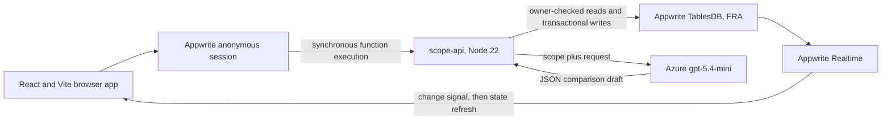

# Receipt architecture

Receipt is a small single-region web application with one browser client, one Appwrite Function, Appwrite TablesDB, and one external model call. The function is the application boundary: the browser invokes actions, while server code validates ownership, evidence, and state transitions.

## Runtime components

### Browser

The React app creates or reuses an anonymous Appwrite session. Every state read and mutation is a `scope-api` execution. The browser subscribes to row changes for projects, scope versions, requests, and events; a notification triggers a debounced state refresh through the function.

The browser has no Azure key and no Appwrite execution key. Its four `VITE_` values are public resource identifiers.

### Appwrite Function

`scope-api` runs on Node 22 and accepts POST requests only. Its action union is:

- `state`
- `createCase`
- `analyze`
- `startManualReview`
- `saveAnalysis`
- `createProposal`
- `getPublic`
- `respond`

The first six actions require the Appwrite user ID from the execution context. `getPublic` and `respond` use an expiring bearer token. The function uses its scoped execution key for TablesDB reads and writes, returns `cache-control: no-store`, and maps internal errors to bounded public messages.

### Azure analysis

The server sends the accepted baseline and incoming request to the configured Azure deployment. The prompt treats both documents as untrusted evidence, requests bounded JSON only, and caps completion at 2,000 tokens to reduce truncation risk within the 24-item bound. Invalid or truncated output falls back to complete manual segmentation. The response must pass the application schema and source-grounding checks:

- 1–24 analysis items
- exact request excerpt for every item
- exact accepted-scope excerpt when one is cited
- mandatory accepted-scope excerpt for `included`
- bounded rationale, confidence, and optional clarification question

Whitespace and case are normalized for matching, but the cited words must otherwise exist in the submitted sources. Invalid output or an unavailable Azure call becomes an explicit manual-review draft.

The configured production route is `gpt-5.4-mini`. Receipt records available latency and token metadata in owner-only AI receipts for operational review, but the public product claims only the deterministic bounds and verified behavior above.

## Data model

| Table | Purpose | Browser-readable |
| --- | --- | --- |
| `projects` | Operator-owned project and client label | Owner only |
| `scope_versions` | Versioned accepted baseline | Owner only |
| `requests` | Request, analysis, proposal, share hash, and decision | Owner only; a bounded projection is available by live capability token |
| `events` | Append-style audit timeline | Owner only |
| `ai_runs` | Model, status, latency, and available token counts | Owner only |
| `ai_budgets` | Atomic request counters | No browser permissions |

All six tables have row security enabled and no table-level permissions. Application rows receive an owner read permission; writes remain in the function.

## Main flows

### 1. Create a scope room

The server creates the project, scope version, request, and initial audit events in one Appwrite transaction. The unchanged Northstar sample also receives its deterministic, exact-citation comparison in that transaction. Other cases start ready for analysis.

### 2. Compare and review

Before an Azure request, the server increments three bounded counters: user/hour, project/month, and global/month. All three increments run in one Appwrite transaction, so a rejected limit or failed write rolls back the whole reservation. Transaction conflicts receive exponential backoff with jitter and at most five attempts; no request partially consumes only the earlier counters.

The Azure result is validated against the original text. The request analysis, audit event, and AI usage receipt then commit in one transaction. On failure, Receipt commits the low-confidence manual-review draft, failure event, and fallback AI receipt together instead.

The operator can correct the structured result, edit exact excerpts, add or remove evidence items within the 1–24 bound, and save that reviewed record. Server grounding validation runs again on save. The save sets `reviewedAt`; proposal creation is rejected until it exists. Pricing and delivery do not exist in the model response schema.

If an automatic comparison is still `analyzing` after its 45-second lease, `startManualReview` can recover the complete request into bounded manual-review segments without another AI call. The server checks the lease again transactionally; an active comparison cannot be displaced early. The manual draft and its honest operator-authored `analysis_ready` audit event commit together.

Normal analysis changes may start only in `ready`, `review`, and retryable `error`. The sole transition from `analyzing` is the lease-gated manual recovery described above. Publishing a proposal moves the request to `proposed` and locks analysis; accepted and rejected requests remain locked.

### 3. Publish a proposal

The server validates the human-entered amount, three-letter uppercase currency code, future delivery date, note, and 1–168-hour lifetime. It generates 32 random bytes, returns the raw token once, stores only its SHA-256 hash, and saves the proposal plus audit event in a transaction.

The web app creates a `#share=...` URL. Fragments are not sent in the initial HTTP request to the site. Rotating a proposal overwrites the stored hash and invalidates the previous link.

### 4. Record a client decision

The function hashes the presented token, finds the proposal, checks its expiry, and returns a limited public projection. A capability holder can accept or decline once. The final request state and audit event are written transactionally. Repeating the same decision is idempotent; an attempt to reverse it returns a conflict.

## Deployment shape

`appwrite.config.json` targets the Appwrite FRA endpoint and includes:

- a static React site (`receipt-web`)
- a Node 22 function (`scope-api`) with `rows.read` and `rows.write` scopes
- the `receipt` database and six tables
- anonymous authentication, REST, and WebSocket support

Live host allowlists, function variables, secrets, and active deployments are operational state and cannot be proven from the checked-in manifests alone.

## Deliberate limits

- Anonymous sessions are demo identities, not recoverable accounts or team membership.
- There is no background queue; analysis runs inside a synchronous function execution with a 14-second outbound timeout and 30-second function timeout, leaving time to persist the manual fallback.
- The timeline is an application audit record, not an immutable legal ledger.
- The repository has unit, type, lint, and build checks but no live Appwrite integration or browser end-to-end suite.
